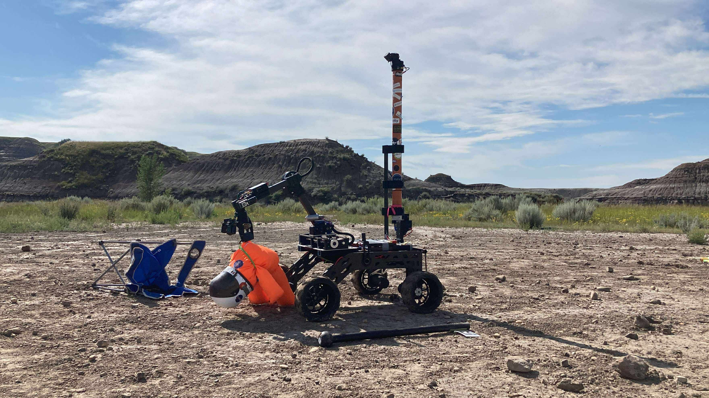
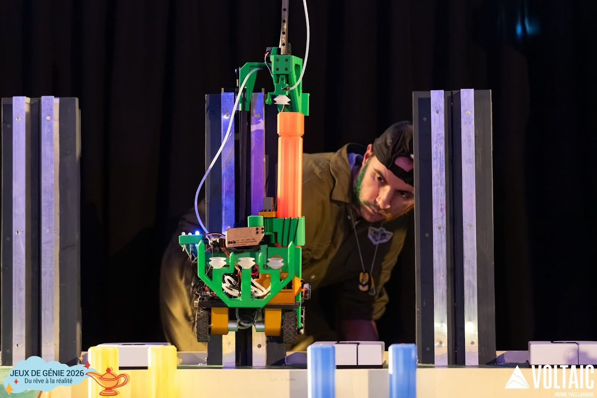
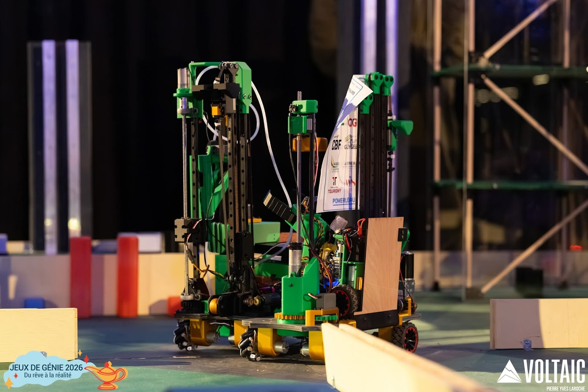
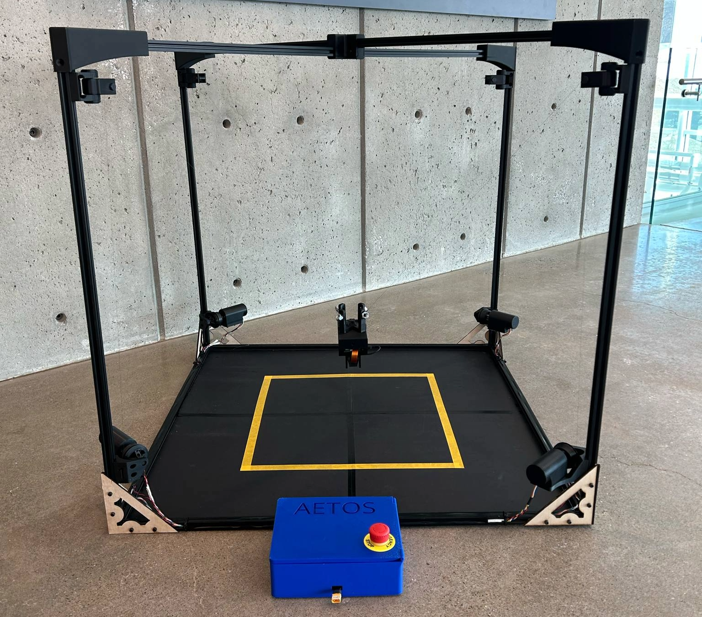

# Émile Savoie
 

Welcome to my portfolio! Below is a selection of projects showcasing my hands-on experience in designing and developing robotic systems and applications. All of these projects are the result of great teamwork and collaboration, but the focus here is on my own contributions.

Enjoy!

## Rovus - Robotique UdeS 

### Project presentation
The goal behind Rovus is to create a 100% student made martian rover. I've been involved in the Rovus project for 3 years now including 1 as co-director focusing on software and electronics development.

### Personnal contributions

#### Software
- Development of high level control (ROS2) of the drive train
- Development of inverse kinematic high level control (ROS2) 

### Results

## La Machine - Jeux de génie

### Project presentation

### Personnal contributions

### Results

## Aetos - School project

## Project presentation

## Personnal contribution

